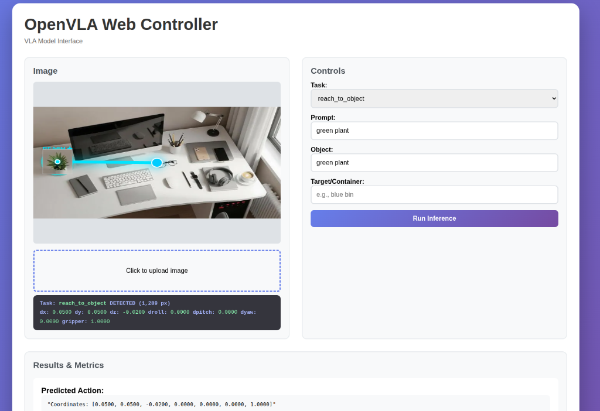

# OpenVLA-ROS2

A comprehensive, deployment-ready workspace for the [OpenVLA](https://github.com/openvla/openvla) (Vision-Language-Action) 7B model. This repository bridges high-level VLM research with practical robotics through 4-bit quantization, ROS 2 middleware, and a real-time monitoring dashboard.

---

## Project Architecture

**Core Engine:**
1.  **`openvla_core`**: The central logic engine. Manages 4-bit/8-bit quantization via `bitsandbytes` to allow the 7B model to run on our GPUs (6GB+ VRAM).

**Deployment Vehicles:**
2.  **`ros2_integration`**: A full ROS 2 workspace that transforms OpenVLA into a robotic "brain," publishing 3D waypoints and annotated feeds.
3.  **`web_interface`**: A modern Flask + Socket.IO dashboard for remote testing and real-time visualization of model outputs.

---

## Environment Setup

### Prerequisites
*   **OS:** Ubuntu 22.04 / 24.04
*   **Frameworks:** ROS 2 (Humble or Jazzy)
*   **Hardware:** NVIDIA GPU (CUDA 12.1+) with at least **6GB VRAM**.

### Installation
1.  **Clone the Repo:**
    ```bash
    git clone https://github.com/DeeptamBhar/OpenVLA_ROS2.git
    cd OpenVLA_ROS2
    ```

2.  **Automated Setup:**
    The setup script handles the virtual environment and heavy dependencies (Torch, Transformers, Accelerate).
    ```bash
    chmod +x scripts/setup_environment.sh
    ./scripts/setup_environment.sh
    source venv/bin/activate
    ```

---

## Deployment Modes

### 1. ROS 2 Integration
Run the model as a live node. This version supports dynamic task switching via ROS topics.
```bash
cd demos/ros2_integration/ros2_ws
colcon build --symlink-install
source install/setup.bash

# Terminal 1: Launch the VLA Controller & Mock Camera
ros2 launch vla_control vla_system.launch.py source_type:=mock
```

### 2. Web Dashboard
The easiest way to demonstrate the project. Upload images and see actions in your browser.
```bash
cd demos/web_interface
python app.py
```

---

## Visualizing in RViz2

When running **ROS 2 Robotics Mode**, you can visualize the "thoughts" of the VLA model in 3D space:

1.  **Launch RViz:** `rviz2`
2.  **Fixed Frame:** Set to `map`.
3.  **Add Displays:**
    *   **3D Waypoints:** Add `/vla/waypoint_markers` (MarkerArray).
    *   **Annotated Feed:** Add `/vla/annotated_image` (Image).

> **Note:** The model uses **4-bit NF4 quantization**. This reduces VRAM usage from ~28GB to **~7GB**, making it accessible for mid-range workstations while maintaining action accuracy.

---

## ROS 2 Architecture

| Topic | Type | Description |
| :--- | :--- | :--- |
| `/camera/image_raw` | `sensor_msgs/Image` | Raw input feed. |
| `/vla/task_command` | `std_msgs/String` | Send `switch:<task_name>` to change AI behavior. |
| `/vla/waypoint_markers`| `viz_msgs/MarkerArray` | 3D visual targets for the robot arm. |
| `/vla/metrics` | `std_msgs/String` | Real-time FPS, Latency, and VRAM logs. |

---

## Configuration
Add custom robotic tasks by editing `config/tasks.yaml`. The system automatically generates the correct prompts for the VLA model.

```yaml
tasks:
  open_drawer:
    prompt: "Open the {drawer} drawer"
    action_dims: 7
```

---

## Preview


